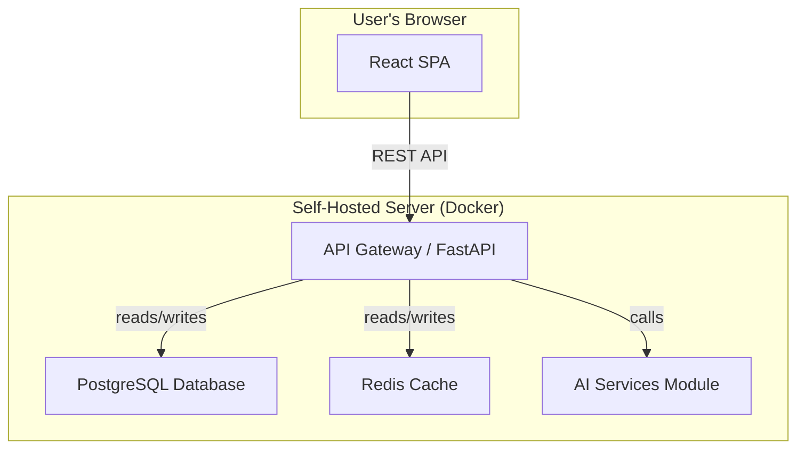
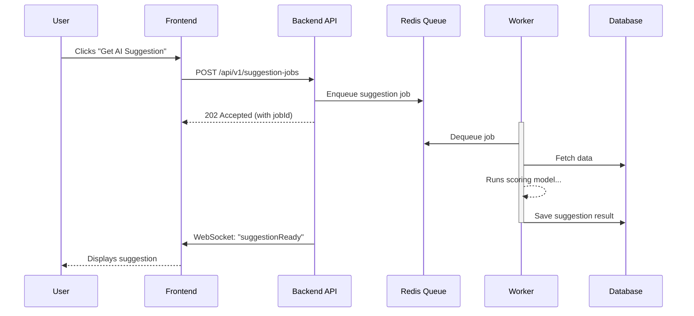

# SprintSense Fullstack Architecture Document

## 1. Introduction

This document outlines the complete fullstack architecture for SprintSense, including backend systems, frontend implementation, and their integration. It serves as the single source of truth for AI-driven development, ensuring consistency across the entire technology stack.

### Starter Template or Existing Project

  - **Decision:** We will build this Greenfield project from scratch.
  - **Rationale:** Our chosen tech stack of FastAPI (Python) + a standard React SPA does not have a common, well-supported starter template. Building from scratch using standard tools (`vite`, standard FastAPI layout) gives us maximum control and avoids fighting against a template's opinions.

### Change Log

| Date | Version | Description | Author |
| :--- | :--- | :--- | :--- |
| 2025-09-15 | 1.0 | Initial draft of the architecture document. | Alex (Architect) |

---

## 2. High Level Architecture

### Technical Summary

The architecture for SprintSense is a **Modular Monolith**, deployed as a set of Docker containers. The frontend is a **React 18 SPA** using the Material-UI component library, which communicates with a **FastAPI (Python 3.11) backend** via a RESTful API. The entire system is designed to be self-hostable and cloud-agnostic, using Docker Compose for orchestration.

### Platform and Infrastructure Choice

  - **Platform:** Generic Containerized Hosting
  - **Key Services:** Nginx, FastAPI/Uvicorn, PostgreSQL, Redis.
  - **Note on Support:** Official support and documentation will prioritize Linux-based Docker hosts.

### Data Persistence & Backup

  - **Production Recommendation:** It is **strongly recommended** to use an external, managed database service for production.
  - **Self-Hosted Database:** If running the database in a Docker container, the user is **fully responsible** for implementing a robust backup strategy. The self-hosting documentation will provide examples.

### Repository Structure

  - **Structure:** Monorepo
  - **Monorepo Tool:** `npm workspaces`
  - **Package Organization:** `apps/web`, `apps/api`, `packages/shared-types`.
  - **Type Safety Strategy:** We will use `openapi-typescript-codegen` to automatically generate TypeScript interfaces from the FastAPI OpenAPI specification.

### High Level Architecture Diagram



### Architectural Patterns

  - **Modular Monolith:** The backend will be a single deployable application with strict internal boundaries between modules.
  - **Component-Based UI:** The frontend will be built as a collection of reusable React components.
  - **Repository Pattern:** The backend will use a data access layer to abstract database logic.
  - **API Gateway:** The main FastAPI application will serve as the single entry point for all client requests.

---

## 3. Tech Stack

| Category | Technology | Version | Purpose | Rationale |
| :--- | :--- | :--- | :--- | :--- |
| Frontend Language | TypeScript | ~5.3 | Type safety for UI code | Reduces runtime errors. |
| Frontend Framework | React | ~18.2.0 | Building the user interface | Massive ecosystem and talent pool. |
| UI Component Library| Material-UI (MUI) | ~5.15.0 | UI components and styling | Accelerates development. |
| State Management | Zustand | ~4.5.0 | Managing global UI state | Simple, fast, and scalable. |
| Backend Language | Python | 3.11 | Core application logic | Excellent for data science/AI. |
| Backend Framework | FastAPI | ~0.109.0 | Building the REST API | High performance and auto-docs. |
| Database | PostgreSQL | 16.2 | Primary data persistence | Powerful and reliable. |
| Cache | Redis | 7.2 | Caching and background tasks | High-performance in-memory store. |
| Build Tool | Vite | ~5.1.0 | Frontend dev server & build | Fast developer experience. |
| CI/CD | GitHub Actions | | Automated builds, tests, deploy | Natively integrated with source code. |
| Monitoring | OpenTelemetry | ~1.22.0 | Performance monitoring | Open standard for telemetry. |
| Logging | structlog | ~24.1.0 | Application logging | Structured, readable logs. |

---

## 4. Data Models

#### User (Revised)

**Purpose:** Represents an individual user account in the system. This is the core entity for authentication and identifying who owns or is assigned to various resources.
**Key Attributes:** `id` (UUID), `displayName` (string), `email` (string), `avatarUrl` (string, optional), `password_hash` (string, backend-only), `created_at` (Date), `updated_at` (Date).

#### Team (Revised)

**Purpose:** Represents a collection of users who collaborate on projects together. It is the primary container for backlogs, sprints, and other shared resources.
**Key Attributes:** `id` (UUID), `name` (string), `created_at` (Date), `updated_at` (Date).

#### TeamMember

**Purpose:** This is a join table entity that connects a `User` to a `Team` and defines their role within that team.
**Key Attributes:** `id` (UUID), `teamId` (FK to Team), `userId` (FK to User), `role` (enum: 'owner', 'member'), `created_at` (Date).

#### WorkItem (Revised)

**Purpose:** Represents a single, atomic unit of work in the backlog, such as a user story, bug, or task.
**Key Attributes:** `id` (UUID), `teamId` (FK), `sprintId` (FK, nullable), `authorId` (FK), `assigneeId` (FK, nullable), `type` (enum: 'story', 'bug', 'task'), `title` (string), `description` (string, nullable), `status` (enum: 'backlog', 'todo', 'in_progress', 'done', 'archived'), `priority` (float), `storyPoints` (integer, nullable), `completedAt` (Date, nullable), `created_at` (Date), `updated_at` (Date), `sourceSprintIdForActionItem` (FK, nullable).

#### Sprint (Revised)

**Purpose:** Represents a time-boxed iteration (typically 1-4 weeks) during which a committed amount of work is completed.
**Key Attributes:** `id` (UUID), `teamId` (FK), `name` (string), `status` (enum: 'future', 'active', 'closed'), `startDate` (Date), `endDate` (Date), `goal` (string).

#### ProjectGoal (Revised)

**Purpose:** Represents a high-level strategic goal for a team, used by the AI Prioritization Service.
**Key Attributes:** `id` (UUID), `teamId` (FK), `description` (string), `priority` (integer), `metric` (string, nullable), `authorId` (FK).

#### RetrospectiveFeedback

**Purpose:** Represents a single piece of feedback—a "card"—submitted by a team member during a sprint retrospective.
**Key Attributes:** `id` (UUID), `sprintId` (FK), `authorId` (FK, nullable), `category` (enum: 'went_well', 'did_not_go_well', 'try_next'), `content` (string).

#### Invitation

**Purpose:** Represents an invitation for a user to join a team.
**Key Attributes:** `id` (UUID), `teamId` (FK), `email` (string), `role` (enum: 'owner', 'member'), `status` (enum: 'pending', 'accepted', 'declined'), `inviterId` (FK).

---

## 5. API Specification

The SprintSense API is a RESTful API that uses JSON for serialization. Authentication will be handled via secure, HTTP-only cookies. The full, interactive OpenAPI 3.0 specification will be automatically generated by the FastAPI backend and available at the `/docs` endpoint.

#### Example Schema: WorkItem

```yaml
WorkItem:
  type: object
  properties:
    id: { type: string, format: uuid }
    teamId: { type: string, format: uuid }
    sprintId: { type: string, format: uuid, nullable: true }
    authorId: { type: string, format: uuid }
    assigneeId: { type: string, format: uuid, nullable: true }
    type: { $ref: '#/components/schemas/WorkItemType' }
    title: { type: string }
    description: { type: string, nullable: true }
    status: { $ref: '#/components/schemas/WorkItemStatus' }
    priority: { type: number, format: double }
    storyPoints: { type: integer, nullable: true }
    completedAt: { type: string, format: date-time, nullable: true }
    createdAt: { type: string, format: date-time }
    updatedAt: { type: string, format: date-time }
    sourceSprintIdForActionItem: { type: string, format: uuid, nullable: true }
```

#### Example Endpoints: Work Items

```yaml
/teams/{teamId}/work-items:
  get:
    summary: List and filter work items for a team
    description: Returns a paginated list of work items. User must be a member of the team.
    parameters:
      - { name: limit, in: query, schema: { type: integer, default: 50 } }
      - { name: offset, in: query, schema: { type: integer, default: 0 } }
    responses:
      '200':
        description: A paginated list of work items.
  post:
    summary: Create a new work item for a team
    description: Creates a new work item. User must be a member of the team.
```

---

## 6. Components

#### Component Diagram

```mermaid
C4Container
  title "Component Diagram for SprintSense (Detailed)"
  Person(user, "User", "A user of the SprintSense application.")
  System_Boundary(c1, "SprintSense Application (Self-Hosted Docker Environment)") {
    Container(spa, "Frontend App", "React / Vite", "The single-page application that provides the user interface.")
    Container(web_server, "Web Server", "Nginx", "Serves the frontend application and acts as a reverse proxy for the API.")
    Container(api, "Backend Monolith", "FastAPI / Python", "Contains all business logic and AI services.") {
      Component(auth_service, "Auth Service", "Handles user identity and sessions.")
      Component(team_service, "Team Service", "Manages teams and memberships.")
      Component(backlog_service, "Backlog & Sprint Service", "Manages work items and sprints.")
      Component(ai_prio_service, "AI Prioritization Service", "Ranks backlog items.")
      Component(ai_retro_service, "AI Retrospective Service", "Analyzes retrospective feedback.")
      Component(ai_sim_service, "AI Simulation Service", "Forecasts sprint outcomes.")
    }
    ContainerDb(db, "Database", "PostgreSQL", "Stores all primary application data.")
    ContainerDb(cache, "Cache", "Redis", "Used for session storage and background task queuing.")
  }
  Rel(user, web_server, "Uses", "HTTPS")
  Rel(web_server, spa, "Serves static files")
  Rel(spa, web_server, "Makes API calls to /api/*")
  Rel(web_server, api, "Proxies /api/* requests to")
  Rel(api, db, "Reads/Writes")
  Rel(api, cache, "Reads/Writes")
  Rel(backlog_service, team_service, "Uses for authorization")
  Rel(team_service, auth_service, "Uses for user context")
```

#### Component List

**1. Web Server (Nginx)**

  - **Responsibility:** Serves the static assets for the React SPA. Acts as a reverse proxy, directing API requests to the backend service.
  - **Dependencies:** Frontend App (files), Backend Monolith (API).
  - **Technology Stack:** Nginx.

**2. Frontend App (React SPA)**

  - **Responsibility:** Renders the UI, manages local UI state.
  - **Dependencies:** Web Server (for API calls).
  - **Technology Stack:** React, MUI, Zustand, Vite.

**3. Backend Monolith (FastAPI)**

  - **Responsibility:** The container for all backend modules.
  - **Dependencies:** Database, Cache.
  - **Technology Stack:** FastAPI, Python.

**4. Auth Service (Internal Module)**

  - **Responsibility:** Manages user identity, registration, login, and sessions.
  - **Dependencies:** Database, Cache.

**5. Team Service (Internal Module)**

  - **Responsibility:** Manages teams and user membership/roles.
  - **Dependencies:** Database, Auth Service.

**6. Backlog & Sprint Service (Internal Module)**

  - **Responsibility:** Manages Work Items and Sprints.
  - **Dependencies:** Database, Team Service (for permissions).

**7. AI Prioritization Service (Internal Module)**

  - **Responsibility:** Ranks backlog items based on project goals.
  - **Dependencies:** Backlog & Sprint Service (to get data).

**8. AI Retrospective Service (Internal Module)**

  - **Responsibility:** Analyzes retrospective feedback for themes and sentiment.
  - **Dependencies:** Backlog & Sprint Service (to get data).

**9. AI Simulation Service (Internal Module)**

  - **Responsibility:** Forecasts sprint outcomes based on historical velocity.
  - **Dependencies:** Backlog & Sprint Service (to get data).

---

## 7. Core Workflows

#### 1. New User Registration and Team Creation (with Transaction)

```mermaid
sequenceDiagram
    participant User
    participant Frontend
    participant Backend API
    participant Auth Service
    participant Team Service
    participant Database
    User->>Frontend: Submits Registration form
    Frontend->>Backend API: POST /api/v1/users
    box "Database Transaction"
        Team Service->>Database: BEGIN
        Team Service->>Database: INSERT into teams
        Team Service->>Database: INSERT into team_members (role='owner')
        Team Service->>Database: COMMIT
    end
```

#### 2. AI Backlog Prioritization Suggestion (Asynchronous)



---

## 8. Database Schema

The detailed database schema will be implemented via Alembic migration scripts, as defined in the PRD stories. The schema will enforce foreign key constraints and use appropriate indexing for performance.

---

## 9. Frontend Architecture

The frontend architecture will follow standard best practices for a modern React application. Component organization will be feature-based. Global state will be managed with Zustand, and API communication will be handled in a dedicated service layer.

---

## 10. Backend Architecture

The backend architecture will adhere to the Modular Monolith pattern. FastAPI routers will group endpoints by feature. The Repository Pattern will be strictly enforced for all database interactions.

---

## 11. Unified Project Structure

The project will follow a standard monorepo structure managed by `npm workspaces`:

```
/apps
  /api
  /web
/packages
  /shared-types
  /ui-components
```

---

## 12. Deployment Architecture

The application will be deployed as a set of Docker containers, orchestrated by Docker Compose. An Nginx container will act as a reverse proxy. This setup is designed for portability and straightforward self-hosting.

---
