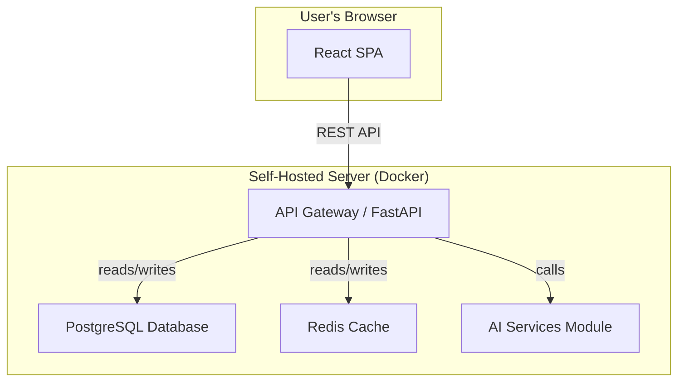

# 2. High Level Architecture

## Technical Summary

The architecture for SprintSense is a **Modular Monolith**, deployed as a set of Docker containers. The frontend is a **React 18 SPA** using the Material-UI component library, which communicates with a **FastAPI (Python 3.11) backend** via a RESTful API. The entire system is designed to be self-hostable and cloud-agnostic, using Docker Compose for orchestration.

## Platform and Infrastructure Choice

  - **Platform:** Generic Containerized Hosting
  - **Key Services:** Nginx, FastAPI/Uvicorn, PostgreSQL, Redis.
  - **Note on Support:** Official support and documentation will prioritize Linux-based Docker hosts.

## Data Persistence & Backup

  - **Production Recommendation:** It is **strongly recommended** to use an external, managed database service for production.
  - **Self-Hosted Database:** If running the database in a Docker container, the user is **fully responsible** for implementing a robust backup strategy. The self-hosting documentation will provide examples.

## Repository Structure

  - **Structure:** Monorepo
  - **Monorepo Tool:** `npm workspaces`
  - **Package Organization:** `apps/web`, `apps/api`, `packages/shared-types`.
  - **Type Safety Strategy:** We will use `openapi-typescript-codegen` to automatically generate TypeScript interfaces from the FastAPI OpenAPI specification.

## High Level Architecture Diagram

## Architectural Patterns

  - **Modular Monolith:** The backend will be a single deployable application with strict internal boundaries between modules.
  - **Component-Based UI:** The frontend will be built as a collection of reusable React components.
  - **Repository Pattern:** The backend will use a data access layer to abstract database logic.
  - **API Gateway:** The main FastAPI application will serve as the single entry point for all client requests.

---
