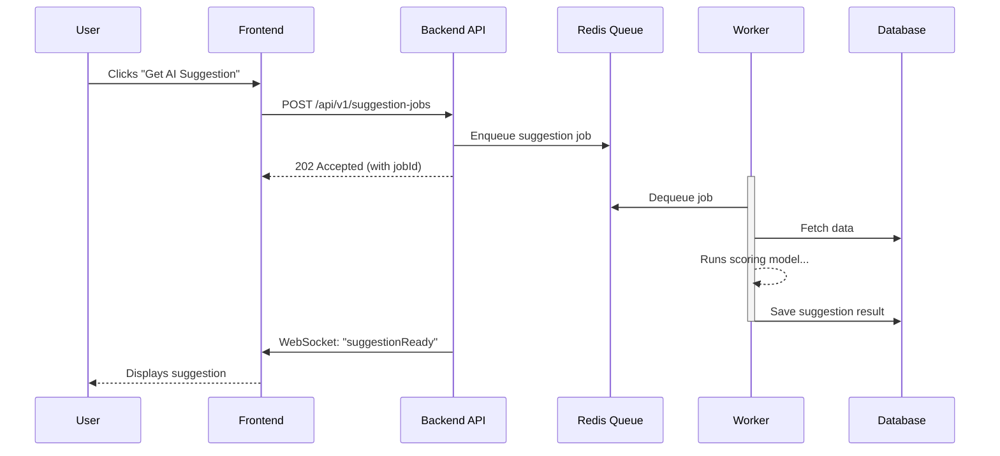

# 7. Core Workflows

### 1. New User Registration and Team Creation (with Transaction)
```mermaid
sequenceDiagram
    participant User
    participant Frontend
    participant Backend API
    participant Auth Service
    participant Team Service
    participant Database
    User->>Frontend: Submits Registration form
    Frontend->>Backend API: POST /api/v1/users
    box "Database Transaction"
        Team Service->>Database: BEGIN
        Team Service->>Database: INSERT into teams
        Team Service->>Database: INSERT into team_members (role='owner')
        Team Service->>Database: COMMIT
    end
```

### 2. AI Backlog Prioritization Suggestion (Asynchronous)


---
