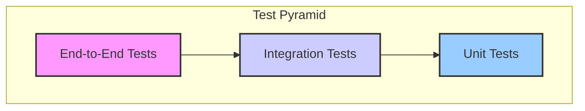

# Testing Standards

This document outlines the testing strategy and standards for the SprintSense project. Adherence to these standards is crucial for maintaining code quality, ensuring reliability, and enabling a smooth development process.

## 1. Guiding Principles

- **Pragmatism over Dogma:** Our strategy, as defined in the PRD, emphasizes a "strong focus on Unit and Integration tests, supplemented by a limited set of critical-path End-to-End (E2E) tests." We prioritize tests that give us the highest confidence for the lowest cost.
- **Test for Confidence:** The goal of testing is to be confident in shipping new features. Every test should increase our confidence in the system's correctness.
- **Developer-Owned Quality:** Quality is the responsibility of the entire team. Developers are expected to write tests for the code they produce.
- **Automation First:** All tests should be automated and integrated into our CI/CD pipeline to provide fast feedback.

## 2. The Test Pyramid

We will follow the principles of the test pyramid to guide the distribution of our tests.

- **Unit Tests (Foundation):** The majority of our tests. They are fast, cheap, and test a single unit (function, class) in isolation.
- **Integration Tests (Middle):** Test the interaction between multiple components. Slower and more expensive than unit tests.
- **End-to-End Tests (Peak):** A small number of tests that simulate a full user journey through the application. They are slow, brittle, and expensive, but provide the highest level of confidence for critical paths.

## 3. Test Levels and Scope

### 3.1. Unit Tests

- **Purpose:** To verify that a single, isolated piece of code (a function, method, or component) works as expected.
- **Scope:**
    - **Backend:** Test individual functions and classes within a service module. The repository layer and other services should be mocked.
    - **Frontend:** Test individual React components (using Storybook and Vitest), utility functions, and Zustand store logic in isolation.
- **Tooling:**
    - **Backend:** `pytest` with `unittest.mock`.
    - **Frontend:** `vitest` and `@testing-library/react`.

### 3.2. Integration Tests

- **Purpose:** To verify that different parts of the system work together correctly.
- **Scope:**
    - **Backend Service Integration:** Test the interaction between different internal services within the modular monolith (e.g., `Backlog & Sprint Service` calling `Team Service`).
    - **Repository/Database Integration:** Test that the Repository Pattern implementation correctly interacts with the PostgreSQL database. These tests should run against a dedicated test database.
    - **API Endpoint Integration:** Test API endpoints by making HTTP requests to the running FastAPI application. These tests verify routing, request/response validation (Pydantic), and business logic execution down to the database.
    - **Asynchronous Workflow Integration:** Test workflows involving Redis. Verify that jobs are correctly enqueued and that workers process them as expected.
- **Tooling:**
    - **Backend:** `pytest` with `httpx` for API testing. Test database fixtures.
    - **Frontend:** N/A (covered by E2E).

### 3.3. End-to-End (E2E) Tests

- **Purpose:** To simulate real user scenarios from start to finish, ensuring the entire system works as a cohesive whole.
- **Scope:** Limited to the most critical user journeys ("critical-path"), such as:
    1.  User Registration -> Team Creation.
    2.  User Login -> Create Work Item -> Assign to Sprint.
    3.  Full Sprint Lifecycle: Start Sprint -> Move item to "Done" -> Close Sprint.
- **Tooling:** Playwright.

## 4. Testing Types

### 4.1. Functional Testing

Covered by the three levels of the test pyramid.

### 4.2. Performance Testing

- **Requirement:** NFR6 specifies average API response times under 200ms.
- **Strategy:**
    - A separate performance testing suite will be created using a tool like `locust`.
    - Tests will target key API endpoints under simulated load.
    - These tests will run in a dedicated performance environment, not as part of the standard CI pipeline.

### 4.3. Security Testing

- **Requirement:** NFR2 (Encryption) and NFR3 (RBAC).
- **Strategy:**
    - **RBAC:** Integration tests must include scenarios for unauthorized access to ensure endpoints are properly protected. Every protected endpoint needs at least one negative test case for permissions.
    - **Static Analysis:** We will use static analysis security testing (SAST) tools like `bandit` for Python to automatically scan for common vulnerabilities.
    - **Dependency Scanning:** GitHub's Dependabot will be used to monitor for vulnerabilities in third-party packages.

### 4.4. Accessibility Testing

- **Requirement:** WCAG 2.1 AA compliance.
- **Strategy:**
    - **Automated:** We will integrate an accessibility testing library (e.g., `axe-core`) into our frontend component and E2E tests.
    - **Manual:** Manual audits using screen readers (VoiceOver, NVDA) will be performed before major releases.
    - **Definition of Done:** All UI stories must include accessibility checks as part of their acceptance criteria.

## 5. Tooling and Implementation

- **Backend Testing:** `pytest`
    - Location: `backend/tests/`
    - Naming: `test_*.py`
- **Frontend Testing:** `vitest`
    - Location: `frontend/src/__tests__/` or alongside component files (`*.test.tsx`).
    - Naming: `*.test.ts[x]`
- **E2E Testing:** Playwright
    - Location: `frontend/tests/`
- **Component Development:** Storybook
    - Location: `frontend/src/stories/`

## 6. CI/CD Integration

- All unit and integration tests **must** pass in the GitHub Actions CI pipeline before a pull request can be merged.
- E2E tests will run on a schedule (e.g., nightly) against a deployed staging environment to provide feedback without slowing down the main CI loop.
- Code coverage reports will be generated and tracked over time, but we will not enforce a strict coverage percentage as a gate. The focus is on quality tests, not just coverage numbers.

## 7. Playwright E2E Testing Best Practices

To ensure our E2E tests are stable, maintainable, and effective, the following best practices should be followed when writing Playwright tests.

### 7.1. Prioritize User-Facing Locators

Tests should interact with the application in the same way a user does. This makes them more resilient to code changes that don't affect the user experience.

- **DO:** Use locators that are visible to the user. The priority is:
    1.  `page.getByRole()`: For accessibility and semantic HTML (e.g., `button`, `heading`, `link`).
    2.  `page.getByText()`: To find elements by their text content.
    3.  `page.getByLabel()`: To find form controls by their associated label text.
- **AVOID:** Using brittle locators tied to implementation details.
    - `getByTestId()`: Should be used sparingly, only as a last resort when no other user-facing locator is practical.
    - CSS selectors (`page.locator('.my-class')`): These are tightly coupled to styling and implementation.
    - XPath selectors: These are powerful but complex and often brittle.

### 7.2. Use the Page Object Model (POM)

For all but the simplest tests, the Page Object Model (POM) should be used to structure test code.

- **What it is:** A design pattern where you create a class for each page or major component of your application. This class encapsulates the locators and methods for interacting with that part of the UI.
- **Why:**
    - **Reusability:** Methods can be reused across multiple tests.
    - **Maintainability:** If the UI changes, you only need to update the locator in one place within the page object class, not in every test that uses it.
    - **Readability:** Tests become cleaner and easier to understand, as they focus on the "what" (e.g., `loginPage.login('user', 'pass')`) rather than the "how" (clicking buttons, filling inputs).

### 7.3. Use Web-First Assertions

Playwright's web-first assertions automatically wait for conditions to be met, which is critical for eliminating flakiness in modern web apps.

- **DO:** Use `expect(locator)` with Playwright's built-in matchers.
    - `expect(locator).toBeVisible()`
    - `expect(locator).toHaveText('Welcome')`
    - `expect(locator).toBeEnabled()`
- **AVOID:** Manual waits and non-Playwright assertions on locators.
    - `page.waitForTimeout(500)`: **NEVER** use fixed timeouts. This is the primary source of flaky tests.
    - `expect(await locator.isVisible()).toBe(true)`: This is incorrect. It does not auto-wait and can lead to race conditions.

### 7.4. Isolate Tests with API Setups

Each E2E test should be able to run independently and in any order. Tests should not depend on the state left behind by previous tests.

- **DO:** Use `test.beforeEach` or `test.beforeAll` hooks to prepare the exact state needed for a test.
    - **Prefer API calls for setup:** The fastest and most reliable way to set up state (e.g., creating a user, a team, or a work item) is by making direct API calls to the backend before the test begins. This bypasses the UI and is much faster and less flaky than using the UI to set up data.
- **AVOID:**
    - "Chaining" tests where one test depends on the previous one completing successfully.
    - Relying on a static, pre-existing database state.

### 7.5. Use Tracing for Debugging

Playwright has a powerful tracing feature that records a wealth of information about a test run, making it easy to debug failures.

- **CI Strategy:** Configure `playwright.config.ts` to automatically capture traces on the first retry of a failed test (`trace: 'on-first-retry'`). This gives us the data we need to debug CI failures without slowing down successful runs.
- **Local Debugging:** Use the Playwright Inspector and the `page.pause()` command to step through tests and inspect the page state locally.