# CI/CD Pipeline Audit Report

Generated: 2025-01-17

## Current State Analysis

### ✅ **Existing Strengths**

1. **Solid CI Foundation**
   - Comprehensive linting and testing for both backend (Python) and frontend (TypeScript)
   - Docker containerization setup
   - Health check endpoints implemented (`/api/v1/health`, `/api/v1/health/detailed`)
   - Database integration testing with PostgreSQL services
   - Security scanning with Trivy
   - Coverage reporting with Codecov

2. **Infrastructure Ready**
   - Supabase as backend-as-a-service (local + cloud)
   - Docker Compose for local development
   - GitHub Container Registry integration
   - Environment-specific configuration support

3. **Code Quality**
   - Pre-commit hooks configured
   - Type checking (mypy, TypeScript)
   - Consistent formatting (Black, Prettier)
   - Proper project structure with monorepo setup

### ❌ **Critical Gaps**

1. **Incomplete Deployment Logic**
   ```yaml
   # Current deploy-dev.yml has placeholders
   - name: Deploy to ${{ inputs.environment }}
     run: |
       echo "🚀 Deploying to ${{ inputs.environment }} environment"
       # TODO: Implement actual deployment logic
   ```

2. **Missing Production Pipeline**
   - No production deployment workflow
   - No approval gates or environment protection
   - No rollback mechanisms

3. **Non-functional Health Checks**
   ```yaml
   # Health checks are commented out
   # curl -f "$BACKEND_URL/api/v1/health" || exit 1
   ```

4. **No Notifications**
   - Placeholder notification code without real integrations

### 📋 **Missing Environment Configuration**

#### Required Secrets (per environment)
- `SUPABASE_URL` - Supabase project API URL
- `SUPABASE_ANON_KEY` - Public anonymous key
- `SUPABASE_SERVICE_KEY` - Service role key for admin operations  
- `DATABASE_URL` - Direct database connection string
- `SLACK_WEBHOOK_URL` - For deployment notifications
- `SENTRY_DSN` - Error monitoring (optional)

#### Environment Variables Needed
- `ENVIRONMENT` - dev/staging/prod
- `API_URL` - Backend API base URL
- `FRONTEND_URL` - Frontend application URL
- `LOG_LEVEL` - Logging verbosity

### 🔧 **Technical Debt**

1. **Docker Images**
   - Frontend production Dockerfile is generated dynamically in CI
   - No image vulnerability scanning in production path
   - Missing multi-stage build optimization

2. **Database Migrations**
   - No automated migration strategy
   - No rollback planning for schema changes

3. **Monitoring & Observability**
   - OpenTelemetry instrumentation exists but no export destination configured
   - No uptime monitoring or alerting rules

## Recommended Architecture

```mermaid
graph TB
    A[Developer Push] --> B[CI Pipeline]
    B --> C{Tests Pass?}
    C -->|Yes| D[Build & Push Images]
    C -->|No| E[❌ Block Deployment]
    
    D --> F[Deploy to Dev]
    F --> G[Health Check Dev]
    G -->|Pass| H[Manual Promote to Staging]
    G -->|Fail| I[🔄 Auto Rollback]
    
    H --> J[Deploy to Staging] 
    J --> K[Health Check Staging]
    K -->|Pass| L[Manual Promote to Prod]
    K -->|Fail| M[🔄 Auto Rollback]
    
    L --> N[Deploy to Production]
    N --> O[Health Check Prod]
    O -->|Pass| P[✅ Success Notification]
    O -->|Fail| Q[🚨 Critical Alert & Rollback]
    
    style E fill:#ff6b6b
    style I fill:#ffa726
    style M fill:#ffa726  
    style Q fill:#ff1744
    style P fill:#4caf50
```



## Implementation Priority

1. **Phase 1: Foundation** (High Priority)
   - Real deployment logic with Supabase CLI
   - Working health checks and notifications
   - Environment-specific configuration

2. **Phase 2: Production Pipeline** (High Priority)
   - Staging and production workflows
   - Approval gates and security checks
   - Automated rollback mechanisms

3. **Phase 3: Observability** (Medium Priority)
   - Monitoring integration
   - Performance metrics
   - Error tracking and alerting

4. **Phase 4: Optimization** (Low Priority)
   - Advanced caching strategies
   - Parallel deployment strategies
   - Advanced rollback scenarios

## Success Metrics

- **Deployment Frequency**: Target daily deployments to dev
- **Lead Time**: < 15 minutes from merge to dev deployment
- **Recovery Time**: < 5 minutes automatic rollback on failure
- **Success Rate**: > 95% deployment success rate
- **Health Check Coverage**: 100% endpoints monitored

## Next Steps

See todo items for detailed implementation plan starting with environment configuration and real deployment logic.
