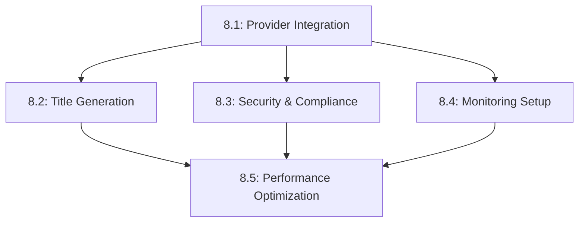

# Epic 8: LLM Integration Stories

## Story Overview

| Story ID | Title | Points | Priority | Dependencies |
|----------|-------|---------|-----------|--------------|
| 8.1 | LLM Service Provider Integration | 8 | High | None |
| 8.2 | Epic Title Generation Feature | 5 | High | 8.1 |
| 8.3 | Security and Compliance Implementation | 5 | High | 8.1 |
| 8.4 | Monitoring and Maintenance Setup | 3 | Medium | 8.1, 8.3 |
| 8.5 | Performance Optimization | 5 | Medium | 8.1, 8.2, 8.3, 8.4 |

## Story Details

### Story 8.1: LLM Service Provider Integration

**As a** Developer,
**I want to** implement a flexible LLM service provider integration,
**so that** we can interact with multiple LLM providers through a consistent interface.

#### Acceptance Criteria
1. **Provider Factory Implementation**
   - ✓ Abstract provider interface defined
   - ✓ Factory pattern implemented for provider creation
   - ✓ Support for OpenAI, Anthropic, and Google providers
   - ✓ Configuration-based provider selection

2. **Caching Implementation**
   - ✓ Redis cache integration for responses
   - ✓ Configurable TTL per request type
   - ✓ Cache key generation handles all parameters
   - ✓ Cache hit/miss metrics tracked

3. **Token Management**
   - ✓ Token usage tracking per request
   - ✓ Token quota management per team
   - ✓ Usage alerts at configurable thresholds
   - ✓ Token optimization strategies implemented

4. **Error Handling**
   - ✓ Provider-specific error mapping
   - ✓ Retry logic with backoff
   - ✓ Circuit breaker implementation
   - ✓ Error logging and monitoring

#### Technical Requirements
```python
# Provider Interface
class BaseLLMProvider(ABC):
    @abstractmethod
    async def complete(
        self,
        prompt: str,
        params: Dict[str, Any]
    ) -> LLMResponse:
        pass

    @abstractmethod
    async def validate_key(self) -> bool:
        pass
```

#### Testing Requirements
- Unit tests for each provider implementation
- Integration tests for caching layer
- Load tests for concurrent requests
- Error handling scenario tests

---

### Story 8.2: Epic Title Generation Feature

**As a** Product Owner,
**I want to** automatically generate epic titles based on descriptions,
**so that** I can maintain consistent and meaningful epic naming.

#### Acceptance Criteria
1. **Title Generation Service**
   - ✓ Implement title generation service
   - ✓ Process epic descriptions effectively
   - ✓ Handle different epic types
   - ✓ Support custom generation parameters

2. **Prompt Builder Integration**
   - ✓ Create title-specific prompt builder
   - ✓ Include context and examples
   - ✓ Support customization options
   - ✓ Handle edge cases gracefully

3. **UI Integration**
   - ✓ Add title generation button to epic form
   - ✓ Show generation loading state
   - ✓ Allow manual editing of generated titles
   - ✓ Provide regeneration option

4. **Title Caching**
   - ✓ Cache similar title generations
   - ✓ Implement cache warming for common patterns
   - ✓ Handle cache invalidation
   - ✓ Track cache effectiveness

#### Technical Requirements
```typescript
interface TitleGenerationRequest {
  description: string;
  context?: {
    category?: string;
    teamId: string;
    examples?: string[];
  };
  options?: {
    maxLength?: number;
    style?: 'concise' | 'detailed';
  };
}
```

#### Testing Requirements
- Unit tests for title generation logic
- Integration tests for prompt building
- UI component tests
- End-to-end title generation flow tests

---

### Story 8.3: Security and Compliance Implementation

**As a** Security Engineer,
**I want to** implement comprehensive security measures for LLM integration,
**so that** we maintain data privacy and security standards.

#### Acceptance Criteria
1. **Key Management**
   - ✓ Implement automated key rotation
   - ✓ Secure key storage solution
   - ✓ Key usage monitoring
   - ✓ Failed rotation alerts

2. **Data Privacy**
   - ✓ PII detection in prompts
   - ✓ Data redaction rules
   - ✓ Audit logging system
   - ✓ Data retention policies

3. **Access Control**
   - ✓ Role-based feature access
   - ✓ Team-level permissions
   - ✓ Usage quotas enforcement
   - ✓ API endpoint security

4. **Compliance Monitoring**
   - ✓ Security event logging
   - ✓ Regular compliance checks
   - ✓ Policy enforcement
   - ✓ Violation alerts

#### Technical Requirements
```python
class SecurityConfig:
    key_rotation_days: int = 90
    max_token_per_team: int = 100000
    audit_retention_days: int = 365
    required_permissions: List[str] = [
        "llm:generate",
        "llm:train"
    ]
```

#### Testing Requirements
- Security penetration tests
- Key rotation testing
- Access control validation
- Compliance policy verification

---

### Story 8.4: Monitoring and Maintenance Setup

**As a** DevOps Engineer,
**I want to** implement comprehensive monitoring and maintenance systems,
**so that** we can ensure reliable operation of the LLM integration.

#### Acceptance Criteria
1. **Grafana Dashboards**
   - ✓ Request rate monitoring
   - ✓ Error rate tracking
   - ✓ Performance metrics
   - ✓ Cost monitoring

2. **Alert Configuration**
   - ✓ Error rate alerts
   - ✓ Performance degradation alerts
   - ✓ Cost threshold alerts
   - ✓ System health alerts

3. **Health Checks**
   - ✓ Provider health monitoring
   - ✓ Cache system checks
   - ✓ Token quota checks
   - ✓ API endpoint health

4. **Maintenance Tasks**
   - ✓ Cache cleanup jobs
   - ✓ Log rotation
   - ✓ Performance optimization tasks
   - ✓ Health report generation

#### Technical Requirements
```yaml
# prometheus/alerts.yml
alerts:
  - name: high_error_rate
    expr: rate(llm_errors_total[5m]) > 0.01
    for: 5m
    labels:
      severity: critical
  - name: high_latency
    expr: llm_request_duration_seconds > 1.5
    for: 5m
    labels:
      severity: warning
```

#### Testing Requirements
- Alert trigger testing
- Dashboard functionality verification
- Health check validation
- Maintenance task testing

---

### Story 8.5: Performance Optimization

**As a** Performance Engineer,
**I want to** optimize the LLM integration performance,
**so that** we provide fast and efficient service to users.

#### Acceptance Criteria
1. **Performance Benchmarking**
   - ✓ Establish baseline metrics
   - ✓ Implement benchmark suite
   - ✓ Track performance trends
   - ✓ Generate performance reports

2. **Token Optimization**
   - ✓ Implement prompt compression
   - ✓ Optimize token usage
   - ✓ Track token efficiency
   - ✓ Reduce unnecessary tokens

3. **Cache Strategy**
   - ✓ Optimize cache keys
   - ✓ Implement cache warming
   - ✓ Fine-tune TTL values
   - ✓ Monitor cache efficiency

4. **Response Time Optimization**
   - ✓ Optimize request handling
   - ✓ Implement request batching
   - ✓ Reduce API latency
   - ✓ Monitor response times

#### Technical Requirements
```python
class PerformanceConfig:
    cache_ttl: int = 3600
    max_batch_size: int = 10
    min_tokens: int = 50
    max_tokens: int = 500
    target_latency_ms: int = 500
```

#### Testing Requirements
- Performance benchmark tests
- Load testing scenarios
- Cache efficiency testing
- Response time validation

## Story Dependencies



## Implementation Timeline

Sprint 1 (13 points):
- Story 8.1: Provider Integration (8 points)
- Story 8.3: Security & Compliance (5 points)

Sprint 2 (13 points):
- Story 8.2: Title Generation (5 points)
- Story 8.4: Monitoring Setup (3 points)
- Story 8.5: Performance Optimization (5 points)

## Change History

| Date | Version | Description | Author |
|------|---------|-------------|---------|
| 2025-09-26 | 1.0.0 | Initial stories breakdown | BMAD Orchestrator |
