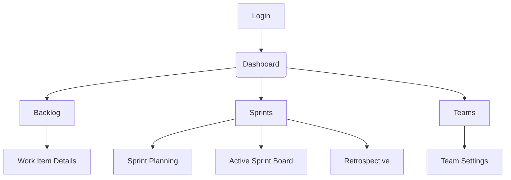

# SprintSense UI/UX Specification

## Introduction

This document defines the user experience goals, information architecture, user flows, and visual design specifications for SprintSense's user interface. It serves as the foundation for visual design and frontend development, ensuring a cohesive and user-centered experience.

### Overall UX Goals & Principles

#### Target User Personas

  - **Power User:** Technical professionals who need advanced features and efficiency.
  - **Casual User:** Occasional users who prioritize ease of use and clear guidance.
  - **Administrator:** System managers who need control and oversight capabilities.

#### Usability Goals

  - Ease of learning: New users can complete core tasks within 5 minutes.
  - Efficiency of use: Power users can complete frequent tasks with minimal clicks.
  - Error prevention: Clear validation and confirmation for destructive actions.
  - Memorability: Infrequent users can return without relearning.

#### Design Principles

1. **Clarity over cleverness:** Prioritize clear communication over aesthetic innovation.
2. **Progressive disclosure:** Show only what's needed, when it's needed.
3. **Consistent patterns:** Use familiar UI patterns throughout the application.
4. **Immediate feedback:** Every action should have a clear, immediate response.
5. **Accessible by default:** Design for all users from the start.

### Change Log

| Date | Version | Description | Author |
| :--- | :--- | :--- | :--- |
| 2025-09-15 | 1.0 | Initial Draft | Sally (UX Expert) |

---

## Information Architecture (IA)

### Site Map / Screen Inventory



### Navigation Structure

**Primary Navigation:** A persistent vertical sidebar on the left-hand side will serve as the primary navigation for the application. This is a common and easily scalable pattern for applications with multiple top-level views like a Dashboard, Backlog, and Sprints.

**Secondary Navigation:** Secondary navigation will be handled via tabs within each main section. For example, the "Sprints" section will have tabs for "Planning", "Active Board", and "Retrospective".

**Breadcrumb Strategy:** Breadcrumbs will be used to show the user's current location within the application, especially in nested views like "Sprints > Sprint Planning > Work Item #123".

---

## User Flows

### Flow: User Registration and Team Creation

**User Goal:** A new user wants to sign up, create a team, and get to their dashboard.

**Entry Points:** Homepage "Sign Up" button.

**Success Criteria:** The user has successfully created an account and a new team, and is viewing the main dashboard.

#### Flow Diagram

```mermaid
graph TD
    A[Start] --> B{User clicks "Sign Up"};
    B --> C[Presents Registration Form];
    C --> D{User submits form};
    D -- Valid data --> E[Create user account];
    E --> F[Log user in];
    F --> G[Redirect to "Create Team" page];
    G --> H{User submits "Create Team" form};
    H -- Valid data --> I[Create team];
    I --> J[Redirect to Dashboard];
    J --> K[End];
    D -- Invalid data --> C;
    H -- Invalid data --> G;
```

#### Edge Cases & Error Handling

  - User enters an email that is already registered.
  - User enters a password that does not meet security requirements.
  - User enters a team name that is already taken.

---

## Wireframes & Mockups

**Primary Design Files:** [Link to Figma/Miro board - to be created]

### Key Screen Layouts

#### Screen: Dashboard

**Purpose:** To provide a high-level overview of the user's projects, sprints, and recent activity.

**Key Elements:**

  - Welcome message
  - List of active sprints
  - Summary of recent notifications
  - Quick access to create new work items or sprints

**Interaction Notes:** The dashboard will be customizable, allowing users to show, hide, and rearrange widgets.

**Design File Reference:** [Link to specific Figma frame - to be created]

---

## Component Library / Design System

**Design System Approach:** We will use Material-UI (MUI) as the primary component library. This provides a comprehensive set of well-tested, accessible, and professionally designed components that will significantly accelerate frontend development and ensure a consistent user experience. We will customize the MUI theme to create a unique brand identity.

### Core Components

#### Component: AI Suggestion Card

**Purpose:** To present AI-generated suggestions in a non-intrusive way.

**Variants:** Information, Warning, Suggestion.

**States:** Default, Hover, Dismissed.

**Usage Guidelines:** Should be used for all AI-driven recommendations. The card should always include an explanation of the suggestion and a "confidence score".

---

## Branding & Style Guide

**Brand Guidelines:** [Link to Brand Guidelines document - to be created]

### Color Palette

| Color Type | Hex Code | Usage |
| :--- | :--- | :--- |
| Primary | #4A90E2 | Main actions, links, and highlights |
| Secondary | #F5A623 | Secondary actions, accents |
| Accent | #BD10E0 | Special highlights, call-to-actions |
| Success | #7ED321 | Positive feedback, confirmations |
| Warning | #F8E71C | Cautions, important notices |
| Error | #D0021B | Errors, destructive actions |
| Neutral | #4A4A4A, #9B9B9B, #FFFFFF | Text, borders, backgrounds |

### Typography

#### Font Families

  - **Primary:** Roboto
  - **Secondary:** Montserrat
  - **Monospace:** Inconsolata

#### Type Scale

| Element | Size | Weight | Line Height |
| :--- | :--- | :--- | :--- |
| H1 | 32px | 700 | 1.2 |
| H2 | 24px | 700 | 1.3 |
| H3 | 18px | 700 | 1.4 |
| Body | 16px | 400 | 1.5 |
| Small | 14px | 400 | 1.5 |

### Iconography

**Icon Library:** Material Icons

**Usage Guidelines:** Icons should be used to enhance clarity and provide visual cues, not as decoration.

### Spacing & Layout

**Grid System:** 12-column grid system.

**Spacing Scale:** 8px base unit (8px, 16px, 24px, 32px, etc.).

---

## Accessibility Requirements

**Compliance Target:** WCAG 2.1 AA

### Key Requirements

**Visual:**

  - Color contrast ratios: Must meet WCAG 2.1 AA requirements.
  - Focus indicators: All interactive elements must have a clear focus state.
  - Text sizing: Users must be able to resize text up to 200% without loss of content or functionality.

**Interaction:**

  - Keyboard navigation: All functionality must be accessible via keyboard.
  - Screen reader support: The application must be compatible with modern screen readers (e.g., NVDA, VoiceOver).
  - Touch targets: All touch targets must be at least 44x44 pixels.

**Content:**

  - Alternative text: All images must have descriptive alt text.
  - Heading structure: Headings must be used in a logical order.
  - Form labels: All form fields must have associated labels.

**Testing Strategy:** Accessibility will be tested manually with keyboard-only navigation and screen readers, and automatically with tools like Axe.

---

## Responsiveness Strategy

### Breakpoints

| Breakpoint | Min Width | Max Width | Target Devices |
| :--- | :--- | :--- | :--- |
| Mobile | 320px | 767px | Smartphones |
| Tablet | 768px | 1023px | Tablets |
| Desktop | 1024px | 1439px | Laptops, desktops |
| Wide | 1440px | - | Large monitors |

### Adaptation Patterns

**Layout Changes:** On smaller screens, multi-column layouts will stack vertically.

**Navigation Changes:** On mobile, the primary navigation will be collapsed into a hamburger menu.

**Content Priority:** On smaller screens, less critical information will be hidden by default and accessible via "show more" buttons.

**Interaction Changes:** Hover-based interactions will be replaced with click/tap interactions on touch devices.

---

## Animation & Micro-interactions

**Motion Principles:** Animations should be subtle, purposeful, and used to provide feedback and guide the user's attention. Avoid purely decorative animations.

### Key Animations

  - **Page Transitions:** A subtle fade-in/fade-out effect will be used for page transitions. (Duration: 200ms, Easing: ease-in-out)
  - **Button Clicks:** Buttons will have a subtle "press" effect on click. (Duration: 100ms, Easing: ease-out)
  - **Modal Windows:** Modals will appear with a slight scale-up and fade-in effect. (Duration: 300ms, Easing: ease-out)

---

## Performance Considerations

### Performance Goals

  - **Page Load:** Largest Contentful Paint (LCP) under 2.5 seconds.
  - **Interaction Response:** First Input Delay (FID) under 100ms.
  - **Animation FPS:** Animations should maintain a consistent 60 frames per second.

### Design Strategies

  - Use skeleton screens for loading states to improve perceived performance.
  - Lazy-load images and other non-critical assets.
  - Optimize images and use modern formats like WebP.

---

## Next Steps

### Immediate Actions

1. Review the UI/UX specification with stakeholders.
2. Create detailed wireframes and mockups in Figma.
3. Handoff the specification to the Design Architect for frontend architecture planning.

### Design Handoff Checklist

  - [x] All user flows documented
  - [x] Component inventory complete
  - [x] Accessibility requirements defined
  - [x] Responsive strategy clear
  - [x] Brand guidelines incorporated
  - [x] Performance goals established

---

## Checklist Results

N/A - No UI/UX checklist has been defined for this project yet.
