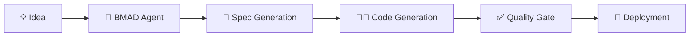

# 🚀 SprintSense Warp Drive Index

## Your comprehensive navigation hub for the SprintSense AI-powered agile project management platform

---

## 📋 Table of Contents

- [🎯 Project Overview](#-project-overview)
- [⚡ Quick Navigation](#-quick-navigation)
- [🏗️ Technical Stack](#️-technical-stack)
- [📁 Directory Structure](#-directory-structure)
- [🔄 Development Workflows](#-development-workflows)
- [📁 Codebase Analysis](#-codebase-analysis-workflow)
- [📚 Documentation Index](#-documentation-index)
- [🚀 Getting Started](#-getting-started)
- [🎭 BMAD Persona Switching](#-bmad-persona-switching)
- [🤖 AI & BMAD Integration](#-ai--bmad-integration)
- [🛠️ Development Tools](#️-development-tools)

---

## 🎯 Project Overview

**SprintSense** is an open-source, AI-powered agile project management platform designed to enhance team collaboration through intelligent automation while prioritizing human agency and data privacy.

### 🎯 Mission

Transform reactive project management into proactive, intelligent workflow optimization for development teams.

### 👥 Target Users

- **Primary:** Development teams (10-50 members) in tech companies
- **Secondary:** Remote-first organizations seeking enhanced collaboration

### 💡 Key Value Propositions

- ✨ **AI-Augmented Sprint Planning** with predictive insights
- 🔒 **Privacy-First Architecture** with self-hosting capabilities
- 🎯 **Smart Backlog Prioritization** using multi-criteria decision analysis
- 🔍 **Intelligent Retrospective Analysis** with pattern recognition
- 📊 **Probabilistic Sprint Forecasting** with Monte Carlo simulations

### 📈 Current Status

- **Phase:** MVP Development (Foundation & Core Features)
- **Version:** Development (Pre-release)
- **Target:** 10 pilot teams within 4 months
- **Goal:** 20% improvement in sprint predictability

---

## ⚡ Quick Navigation

### 🗺️ **Core Documentation**

- [📋 Product Requirements Document](./docs/prd.md) - Complete PRD with epics and user stories
- [🏗️ Architecture Overview](./docs/architecture.md) - Full system architecture documentation
- [📐 Frontend Specification](./docs/front-end-spec.md) - UI/UX guidelines and component specs
- [📝 Project Brief](./docs/brief.md) - Executive summary and project context

### 🛠️ **Development Resources**

- [🤖 BMAD Core Workflows](./.bmad-core/) - AI-assisted development methodology
- [🎨 AI Code Quality Guidelines](./claude_suggestions.md) - Claude optimization strategies
- [📊 Web Bundles](./web-bundles/) - BMAD agent configurations and teams

### 🚀 **Quick Actions**

- **Start Development:** Follow [Getting Started](#-getting-started) guide
- **Review Architecture:** Jump to [Technical Stack](#️-technical-stack)
- **Contribute:** See [Development Workflows](#-development-workflows)
- **AI Assistance:** Check [BMAD Integration](#-ai--bmad-integration)

---

## 🏗️ Technical Stack

### 🎯 **Architecture Pattern**

**Modular Monolith** with strict internal boundaries, deployed via Docker containers

### 💻 **Core Technologies**

| Category | Technology | Version | Purpose |
|----------|------------|---------|---------|
| 🌐 **Frontend** | React | ~18.2.0 | User interface framework |
| 📝 **Language** | TypeScript | ~5.3 | Type safety |
| 🎨 **UI Library** | Material-UI (MUI) | ~5.15.0 | Component library |
| 🗂️ **State** | Zustand | ~4.5.0 | State management |
| 🐍 **Backend** | FastAPI | ~0.109.0 | REST API framework |
| 🐍 **Language** | Python | 3.11 | Backend runtime |
| 🗄️ **Database** | PostgreSQL | 16.2 | Primary data store |
| ⚡ **Cache** | Redis | 7.2 | Caching & background tasks |
| 🏗️ **Build** | Vite | ~5.1.0 | Frontend build tool |
| 🚀 **Deployment** | Docker Compose | Latest | Container orchestration |

### 🛠️ **Development Tools**

- **Package Manager:** npm workspaces (monorepo)
- **Type Generation:** openapi-typescript-codegen
- **Testing:** Jest (planned), Pytest (planned)
- **Linting:** ESLint, Ruff
- **Monitoring:** OpenTelemetry, structlog
- **CI/CD:** GitHub Actions

### 🏛️ **High-Level Architecture**

```text
┌─────────────────┐    ┌──────────────────────┐
│   React SPA     │────│   FastAPI Backend    │
│  (TypeScript)   │    │     (Python)         │
└─────────────────┘    └──────────┬───────────┘
                                  │
                       ┌──────────┴───────────┐
                       │                      │
                ┌──────▼──────┐    ┌─────────▼─────────┐
                │ PostgreSQL  │    │      Redis        │
                │  Database   │    │ Cache & Queue     │
                └─────────────┘    └───────────────────┘
```

---

## 📁 Directory Structure

```text
SprintSense/
├── 📚 docs/                    # Comprehensive documentation
│   ├── 📋 prd.md              # Product Requirements (sharded)
│   ├── 🏗️ architecture.md     # System architecture (sharded)
│   ├── 📐 front-end-spec.md   # Frontend specifications
│   ├── 📝 brief.md            # Project brief
│   ├── 📁 prd/                # PRD shards by epic
│   └── 📁 architecture/        # Architecture shards
│
├── 🤖 .bmad-core/             # BMAD AI Development Framework
│   ├── 🎭 agents/             # AI agent definitions
│   ├── 📋 tasks/              # BMAD workflow tasks
│   ├── 📊 templates/          # Document templates
│   ├── ✅ checklists/         # Quality gates & checklists
│   ├── 🔄 workflows/          # Greenfield/Brownfield workflows
│   └── 📝 core-config.yaml    # BMAD configuration
│
├── 🌐 .claude/                # Claude AI IDE integration
│   └── 📋 commands/BMad/      # Claude-specific BMAD commands
│
├── 🧠 .gemini/                # Gemini AI IDE integration
│   └── 📋 commands/BMad/      # Gemini-specific BMAD commands
│
├── 📦 web-bundles/            # BMAD agent bundles & configurations
│   ├── 🤖 agents/            # Packaged agent definitions
│   ├── 👥 teams/             # Pre-configured team setups
│   └── 🎯 expansion-packs/   # Specialized domain packs
│
├── 🎨 claude_suggestions.md   # AI code quality guidelines
├── 📄 .roomodes              # Development environment config
└── 🚀 warp.md                # This navigation index
```

### 📂 **Key Directories Explained**

- **📚 `docs/`** - All project documentation with sharded PRD and architecture
- **🤖 `.bmad-core/`** - Core BMAD framework for AI-assisted development
- **📦 `web-bundles/`** - Packaged agent configurations and team templates
- **🎨 `claude_suggestions.md`** - Advanced AI prompting strategies and quality guidelines
- **⚙️ `.roomodes`** - Environment configuration for development tools

---

## 🔄 Development Workflows

### 🤖 **BMAD-Powered Development Cycle**

```text
💡 Idea → 📝 Spec Shard → 👩‍💻 Code Shard → ✅ Quality Gate → 🚀 Deploy
```

1. **💡 Ideation Phase**
   - Use `.bmad-core/tasks/create-next-story.md` for user story generation
   - Leverage AI agents for requirement elicitation
   - Document in PRD shards (`docs/prd/`)

2. **📝 Specification Phase**
   - Generate technical specifications using BMAD templates
   - Update architecture shards as needed
   - Validate with `.bmad-core/checklists/`

3. **👩‍💻 Implementation Phase**
   - Follow `claude_suggestions.md` for AI-assisted coding
   - Use agent teams from `web-bundles/teams/`
   - Maintain coding standards and patterns

4. **✅ Quality Assurance**
   - Execute `.bmad-core/tasks/qa-gate.md` processes
   - Run automated test suites
   - Code review with AI assistance

### 🎯 **AI-Assisted Development Guidelines**

Based on `claude_suggestions.md`:

#### 🏗️ **Architectural Compliance**

- Always reference current system architecture
- Maintain consistent naming conventions
- Include proper error handling and separation of concerns

#### 🎨 **Creative Frontend Development**

- **Forbidden:** Generic blue/white/gray schemes, Bootstrap defaults
- **Required:** Unique color palettes, innovative navigation, custom animations
- **Target:** 8/10+ creativity score for all UI components

#### 🔍 **Quality Validation Pipeline**

1. **Syntax & Standards** - Language compliance, coding standards
2. **Architecture Compliance** - Design patterns, dependency injection
3. **Integration Readiness** - API contracts, database alignment

### 📁 **Codebase Analysis Workflow**

#### 🗜️ **Flatten Codebase Command**

For AI analysis, code reviews, and comprehensive codebase understanding:

```bash
# Basic flatten (all code files)
find . -type f \( -name "*.py" -o -name "*.ts" -o -name "*.tsx" -o -name "*.js" -o -name "*.jsx" \) \
  -not -path "*/node_modules/*" \
  -not -path "*/.git/*" \
  -not -path "*/dist/*" \
  -not -path "*/build/*" \
  -exec echo "=== {} ===" \; -exec cat {} \; > flattened_codebase.txt

# Flatten with documentation (comprehensive)
find . -type f \( -name "*.py" -o -name "*.ts" -o -name "*.tsx" -o -name "*.js" -o -name "*.jsx" -o -name "*.md" -o -name "*.yaml" -o -name "*.yml" -o -name "*.json" \) \
  -not -path "*/node_modules/*" \
  -not -path "*/.git/*" \
  -not -path "*/dist/*" \
  -not -path "*/build/*" \
  -not -path "*/web-bundles/*" \
  -exec echo "=== {} ===" \; -exec cat {} \; > flattened_full.txt

# Flatten specific subsystem (e.g., BMAD core)
find .bmad-core -type f \( -name "*.md" -o -name "*.yaml" \) \
  -exec echo "=== {} ===" \; -exec cat {} \; > flattened_bmad.txt

# Flatten documentation only
find docs -type f -name "*.md" \
  -exec echo "=== {} ===" \; -exec cat {} \; > flattened_docs.txt
```

#### 🎯 **Use Cases for Flattened Codebase**

1. **🤖 AI Code Review**

   ```bash
   # Generate flattened codebase for AI analysis
   ./scripts/flatten-codebase.sh --type=code --output=ai_review.txt
   # Share ai_review.txt with Claude/GPT for comprehensive review
   ```

2. **📊 Architecture Analysis**

   ```bash
   # Include architecture docs with code
   ./scripts/flatten-codebase.sh --type=full --include-docs --output=arch_analysis.txt
   ```

3. **🔍 Debugging & Troubleshooting**

   ```bash
   # Focus on specific modules
   ./scripts/flatten-codebase.sh --filter="backend|frontend" --output=debug.txt
   ```

4. **📝 Documentation Generation**

   ```bash
   # Extract all documentation for AI-powered doc generation
   ./scripts/flatten-codebase.sh --type=docs --output=doc_source.txt
   ```

#### 🛠️ **Advanced Flatten Script** (Planned)

Create `scripts/flatten-codebase.sh`:

```bash
#!/bin/bash
# Advanced codebase flattening script for SprintSense
# Usage: ./scripts/flatten-codebase.sh [options]

# Options:
# --type=code|docs|full|bmad
# --output=filename.txt
# --filter=regex_pattern
# --exclude=pattern
# --include-tests
# --max-size=MB

# Example usage:
# ./scripts/flatten-codebase.sh --type=code --output=ai_context.txt --max-size=5
```

### ⚡ **Quick Commands**

```bash
# Development setup (planned)
make dev              # Start development environment
make test             # Run test suite
make lint             # Run code linting
make docs             # Generate documentation

# Codebase analysis
make flatten          # Generate flattened codebase for AI
make flatten-docs     # Flatten documentation only
make flatten-code     # Flatten source code only

# BMAD workflows
bmad create-story     # Generate new user story
bmad qa-gate         # Execute quality gate
bmad review-code     # AI-assisted code review
bmad flatten-context  # Generate AI context from codebase
```

---

## 📚 Documentation Index

### 📋 **Product Documentation**

- [📋 Product Requirements Document](./docs/prd.md) - Master PRD
  - [🎯 Goals & Background](./docs/prd/1-goals-and-background-context.md)
  - [📝 Requirements](./docs/prd/2-requirements.md)
  - [🎨 UI Design Goals](./docs/prd/3-user-interface-design-goals.md)
  - [🔧 Technical Assumptions](./docs/prd/4-technical-assumptions.md)
  - [📊 Epic List](./docs/prd/5-epic-list.md)
  - [📖 Epic Details](./docs/prd/6-epic-details.md)
- [📝 Project Brief](./docs/brief.md) - Executive overview

### 🏗️ **Architecture Documentation**

- [🏗️ System Architecture](./docs/architecture.md) - Master architecture
  - [👋 Introduction](./docs/architecture/1-introduction.md)
  - [🔝 High-Level Architecture](./docs/architecture/2-high-level-architecture.md)
  - [💻 Tech Stack](./docs/architecture/3-tech-stack.md)
  - [📊 Data Models](./docs/architecture/4-data-models.md)
  - [🔌 API Specification](./docs/architecture/5-api-specification.md)
  - [🧩 Components](./docs/architecture/6-components.md)
  - [⚡ Core Workflows](./docs/architecture/7-core-workflows.md)
  - [🗄️ Database Schema](./docs/architecture/8-database-schema.md)
  - [🌐 Frontend Architecture](./docs/architecture/9-frontend-architecture.md)
  - [🐍 Backend Architecture](./docs/architecture/10-backend-architecture.md)
  - [📁 Project Structure](./docs/architecture/11-unified-project-structure.md)
  - [🚀 Deployment Architecture](./docs/architecture/12-deployment-architecture.md)

### 🎨 **Frontend Documentation**

- [📐 Frontend Specification](./docs/front-end-spec.md) - UI/UX guidelines

### 🤖 **BMAD Documentation**

<details>
<summary>Click to expand BMAD framework details</summary>

#### 🎭 **Agent Definitions** (`.bmad-core/agents/`)

- `bmad-master.md` - Master orchestrator agent
- `architect.md` - Technical architecture agent
- `po.md` - Product owner agent
- `pm.md` - Project manager agent
- `dev.md` - Developer agent
- `qa.md` - Quality assurance agent
- `analyst.md` - Business analyst agent

#### 📋 **Task Templates** (`.bmad-core/tasks/`)

- `document-project.md` - Project documentation tasks
- `create-next-story.md` - User story generation
- `qa-gate.md` - Quality assurance gates
- `review-story.md` - Story review processes
- `nfr-assess.md` - Non-functional requirements

#### ✅ **Quality Checklists** (`.bmad-core/checklists/`)

- `story-dod-checklist.md` - Definition of done
- `architect-checklist.md` - Architecture review
- `po-master-checklist.md` - Product owner checklist

</details>

### 🎨 **AI Development Guidelines**

- [🤖 Claude Optimization Strategies](./claude_suggestions.md) - Comprehensive AI development guide

---

## 🚀 Getting Started

### 👩‍💻 **For Developers**

```bash
# 1. Clone the repository
git clone <repository-url>
cd SprintSense

# 2. Review architecture and requirements
open docs/architecture.md
open docs/prd.md

# 3. Set up development environment (planned)
# make install
# make dev

# 4. Start with BMAD workflows
# bmad create-story
```

**📖 Essential Reading:**

1. [🏗️ System Architecture](./docs/architecture.md) - Understand the technical foundation
2. [📋 Epic Details](./docs/prd/6-epic-details.md) - Current development priorities
3. [🤖 AI Guidelines](./claude_suggestions.md) - AI-assisted development practices

### 📐 **For Product Managers & Designers**

```bash
# 1. Review product documentation
open docs/brief.md          # Project overview
open docs/prd.md           # Detailed requirements
open docs/front-end-spec.md # UI guidelines

# 2. Understand current epics
open docs/prd/6-epic-details.md

# 3. Use BMAD for story creation
# bmad create-story
```

**🎯 Key Focus Areas:**

- [📋 Goals & Background](./docs/prd/1-goals-and-background-context.md)
- [🎨 UI Design Goals](./docs/prd/3-user-interface-design-goals.md)
- [📊 Epic List](./docs/prd/5-epic-list.md)

### 🤖 **For AI Agents & Assistants**

```bash
# 1. Initialize BMAD framework
cd .bmad-core/
open core-config.yaml

# 2. Review agent configurations
ls agents/               # Available agents
ls tasks/               # Workflow tasks
ls templates/           # Document templates

# 3. Start with project documentation
open tasks/document-project.md
```

**🔧 Configuration:**

- **BMAD Version:** 4.43.1
- **IDE Setup:** Claude, Gemini, Roo integrations
- **Type:** Full installation with expansion packs

---

## 🎭 BMAD Persona Switching

### ⚡ **Quick Persona Activation**

Simply type any of these phrases to instantly switch to the corresponding BMAD agent persona:

| **Command** | **Agent** | **Icon** | **Role** |
|-------------|-----------|----------|----------|
| `switch to dev` | James | 💻 | Full Stack Developer |
| `switch to architect` | Sarah | 🏗️ | Technical Architect |
| `switch to po` | Alex | 📋 | Product Owner |
| `switch to pm` | Morgan | 🎯 | Project Manager |
| `switch to qa` | Jordan | ✅ | Quality Assurance |
| `switch to analyst` | Taylor | 📊 | Business Analyst |
| `switch to sm` | Casey | 🔄 | Scrum Master |
| `switch to ux-expert` | River | 🎨 | UX Expert |
| `switch to bmad-orchestrator` | BMad Orchestrator | 🎭 | Master Orchestrator |

### 🎯 **Persona Activation Process**

When you request a persona switch, the AI will:

1. **🔄 Load Agent Configuration** - Read the specific agent file from `.bmad-core/agents/`
2. **⚙️ Initialize Core Settings** - Load `core-config.yaml` and required files
3. **🎭 Adopt Identity** - Transform into the agent's personality and role
4. **📋 Display Commands** - Automatically show `*help` with available commands
5. **⏸️ Await Instructions** - Ready to execute agent-specific workflows

### 📋 **Agent-Specific Commands**

Once switched to a persona, all commands use the `*` prefix:

#### 💻 **Dev Agent (James) Commands**

```bash
*help              # Show available commands
*develop-story     # Implement user story tasks sequentially
*explain           # Detailed explanation of recent work
*review-qa         # Apply QA fixes and improvements
*run-tests         # Execute linting and test suites
*exit              # Exit persona and return to general mode
```

#### 🏗️ **Architect Agent (Sarah) Commands**

```bash
*help              # Show available commands
*review-architecture  # Analyze current architecture
*create-design     # Generate technical design documents
*assess-risk       # Evaluate technical risks
*validate-patterns # Check architectural patterns
*exit              # Exit persona and return to general mode
```

#### 📋 **Product Owner (Alex) Commands**

```bash
*help              # Show available commands
*create-story      # Generate new user stories
*prioritize-backlog # Analyze and prioritize features
*review-requirements # Validate business requirements
*stakeholder-sync  # Prepare stakeholder communications
*exit              # Exit persona and return to general mode
```

### 🔄 **Switching Between Personas**

You can switch between personas at any time:

```bash
# From any persona, simply request a switch
"switch to architect"  # Becomes Sarah 🏗️
"switch to dev"        # Becomes James 💻
"switch to qa"         # Becomes Jordan ✅
```

### 🎭 **Master Orchestrator Mode**

Type `switch to bmad-orchestrator` for the ultimate multi-agent experience:

- **🎯 Workflow Coordination** - Manages complex multi-agent tasks
- **🔄 Dynamic Agent Switching** - Automatically switches to best agent for each task
- **📊 Progress Tracking** - Monitors overall project status
- **👥 Team Simulation** - Coordinates multiple agents simultaneously

### ⚙️ **Persona Configuration Files**

Each persona is defined by:

```text
.bmad-core/agents/
├── dev.md                 # 💻 James - Full Stack Developer
├── architect.md           # 🏗️ Sarah - Technical Architect  
├── po.md                  # 📋 Alex - Product Owner
├── pm.md                  # 🎯 Morgan - Project Manager
├── qa.md                  # ✅ Jordan - Quality Assurance
├── analyst.md             # 📊 Taylor - Business Analyst
├── sm.md                  # 🔄 Casey - Scrum Master
├── ux-expert.md           # 🎨 River - UX Expert
└── bmad-orchestrator.md   # 🎭 Master Orchestrator
```

### 🚀 **Quick Start Examples**

#### 🔨 **Development Work**

```text
User: "switch to dev"
James: "Hello! I'm James 💻, your Full Stack Developer. *help to see commands."
User: "*develop-story"
James: "Reading current story requirements and implementing tasks..."
```

#### 📋 **Story Creation**

```text
User: "switch to po" 
Alex: "Hi! I'm Alex 📋, your Product Owner. *help for my commands."
User: "*create-story"
Alex: "Let me generate a new user story based on our backlog..."
```

#### 🏗️ **Architecture Review**

```text
User: "switch to architect"
Sarah: "Greetings! I'm Sarah 🏗️, your Technical Architect. *help for options."
User: "*review-architecture"
Sarah: "Analyzing current system architecture and identifying improvements..."
```

### 💡 **Pro Tips**

- **🎯 Stay in Character**: Each agent maintains their personality until you switch
- **📋 Use Commands**: All agent commands require the `*` prefix
- **🔄 Switch Freely**: No need to exit before switching to another persona
- **🎭 Orchestrator Power**: Use BMad Orchestrator for complex multi-step workflows
- **📚 Context Aware**: Each agent has access to all project documentation and code

---

## 🤖 AI & BMAD Integration

### 🎯 **BMAD Framework Overview**

**BMAD (Business-Focused, AI-Enhanced Agile Development)** is integrated throughout the project to provide:

- 🤖 **AI Agent Teams** - Specialized agents for different roles
- 📋 **Workflow Automation** - Task templates and checklists  
- 🎯 **Quality Gates** - Automated quality assurance
- 📊 **Template Library** - Standardized documentation

### 🎭 **Available Agent Teams**

| Team | Purpose | Configuration |
|------|---------|---------------|
| `team-all.yaml` | Complete development team | All agents active |
| `team-fullstack.yaml` | Full-stack development | Frontend + Backend focus |
| `team-no-ui.yaml` | Backend-only development | API and data focus |
| `team-ide-minimal.yaml` | IDE integration | Lightweight setup |

### 🔄 **Workflow Integration**



### 🗜️ **AI Context Generation**

For optimal AI assistance, use the flatten codebase workflow to provide comprehensive context:

```bash
# Generate AI context for code review
make flatten-code && echo "Share flattened_codebase.txt with AI for review"

# Generate full context for architecture discussions
make flatten && echo "Share flattened_full.txt with AI for architecture analysis"

# Generate BMAD context for workflow assistance
find .bmad-core -name "*.md" -exec echo "=== {} ===" \; -exec cat {} \; > bmad_context.txt
```

#### 🎯 **Best Practices for AI Context**

1. **📏 Size Management**
   - Keep flattened files under 5MB for optimal AI processing
   - Use specific filters for focused analysis
   - Split large codebases by subsystem

2. **🏗️ Context Prioritization**
   - Start with architecture and PRD documents
   - Include relevant code sections based on task
   - Add BMAD workflows for process understanding

3. **🔄 Regular Updates**
   - Regenerate context after major changes
   - Update when switching between epics
   - Refresh for new team members or AI sessions

### 🎨 **AI Quality Standards**

From `claude_suggestions.md`:

#### 🏗️ **Code Generation**

- **Architectural Context** - Always reference system architecture
- **Quality Standards** - Follow established patterns
- **Validation Criteria** - Define acceptance criteria
- **Anti-Patterns** - Avoid common pitfalls

#### 🎨 **Creative Frontend Standards**

- **Minimum Creativity Score:** 8/10
- **Forbidden Patterns:** Generic admin layouts, Bootstrap defaults
- **Required Elements:** Custom animations, unique color palettes
- **Brand Integration:** Reflect product personality

---

## 🛠️ Development Tools

### 🔧 **Planned Development Stack**

```bash
# Frontend Development
npm install              # Install dependencies
npm run dev             # Development server
npm run build           # Production build
npm run test            # Test suite
npm run lint            # Code linting

# Backend Development  
pip install -r requirements.txt  # Dependencies
python -m uvicorn app:app --reload  # Development server
python -m pytest       # Test suite
python -m ruff check    # Linting

# Docker Development
docker-compose up       # Full stack
docker-compose up db    # Database only
```

### 📊 **Quality Assurance Tools**

- **Testing:** Jest (frontend), Pytest (backend)
- **Linting:** ESLint, Ruff
- **Type Checking:** TypeScript, mypy
- **Code Formatting:** Prettier, Black
- **Pre-commit Hooks:** husky, pre-commit

### 🚀 **Deployment & Infrastructure**

- **Containerization:** Docker + Docker Compose
- **Self-hosting:** Complete setup documentation
- **CI/CD:** GitHub Actions
- **Monitoring:** OpenTelemetry integration
- **Logging:** Structured logging with structlog

---

## 🤝 Contributing

### 📋 **Contribution Workflow**

1. **🍴 Fork & Clone** the repository
2. **📖 Read Documentation** - Start with this `warp.md`
3. **🎯 Choose Epic** - Review [Epic Details](./docs/prd/6-epic-details.md)
4. **🤖 Use BMAD** - Generate stories with `.bmad-core/tasks/`
5. **👩‍💻 Develop** - Follow [AI Guidelines](./claude_suggestions.md)
6. **✅ Quality Gates** - Execute `.bmad-core/checklists/`
7. **🔄 Pull Request** - Submit with AI-generated documentation

### 🎯 **Good First Issues**

Look for issues labeled:

- `good-first-issue` - Beginner-friendly
- `documentation` - Documentation improvements
- `ai-assisted` - AI development opportunities
- `bmad-workflow` - BMAD integration tasks

---

## 🆘 Support & Resources

### 📞 **Getting Help**

- 📖 **Documentation Issues** - Check the [Documentation Index](#-documentation-index)
- 🤖 **AI/BMAD Questions** - Review `.bmad-core/` configurations
- 🐛 **Bugs & Issues** - Create GitHub issue with BMAD-generated context
- 💡 **Feature Requests** - Use BMAD story generation templates

### 🔗 **External Resources**

- **FastAPI Documentation** - <https://fastapi.tiangolo.com/>
- **React Documentation** - <https://react.dev/>
- **Material-UI Documentation** - <https://mui.com/>
- **PostgreSQL Documentation** - <https://www.postgresql.org/docs/>
- **Docker Documentation** - <https://docs.docker.com/>

---

## 🌟 Built with BMAD™ - Business-focused, AI-Enhanced Agile Development

**Last Updated:** September 15, 2025  
**BMAD Version:** 4.43.1  
**Document Version:** 1.0

---

*Happy coding! 🚀 Let the AI assist, but keep humans in control.*
